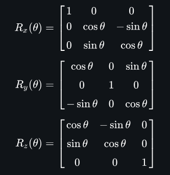

# 3D22D
Perspective projection of 3D space onto a 2D screen. The formula I have used may have been derived earlier but I was inspired by https://www.youtube.com/watch?v=eoXn6nwV694 and derived another formula by myself.

## Explanation

## Output

## Original inspiration
https://www.youtube.com/watch?v=p09i_hoFdd0

## Latter inspiration
https://www.youtube.com/watch?v=eoXn6nwV694

## Process
- I thought the above will be too difficult and started out with no rotation and just projected a 3D cube onto a screen.
- Then I learnt about matrix multiplication and realised its actually easy to rotate the cube, just not easy to get that smooth animation.
- So, I implemented some rotation too in my project. Simple rotation of 45 deg about X-axis.

## Rotation matrices

 
I multiplied my (x, y, z) point in 3D space only with the Rx rotation matrix but all three dimensional rotation can be implemented.
