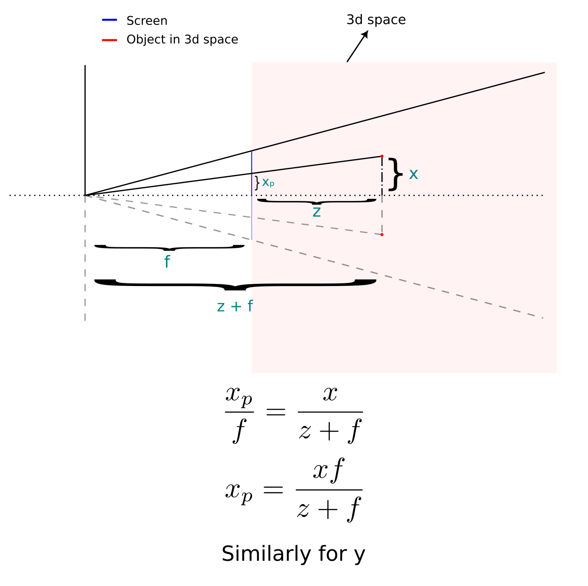
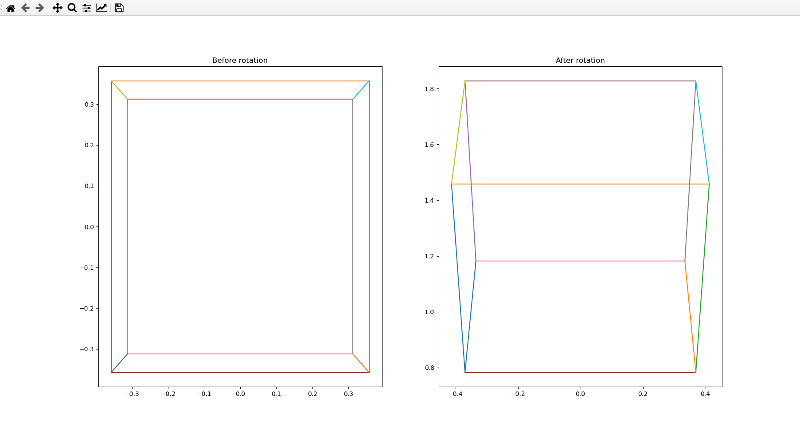

# 3d22d
Perspective projection of 3D space onto a 2D screen. The formula I have used may have been derived earlier but I was inspired by https://www.youtube.com/watch?v=eoXn6nwV694 and derived another formula by myself.

## Explanation

## Output

## Original inspiration
https://www.youtube.com/watch?v=p09i_hoFdd0
I thought this will be too difficult and started out with no rotation and just projected a 3d cube onto a screen.
